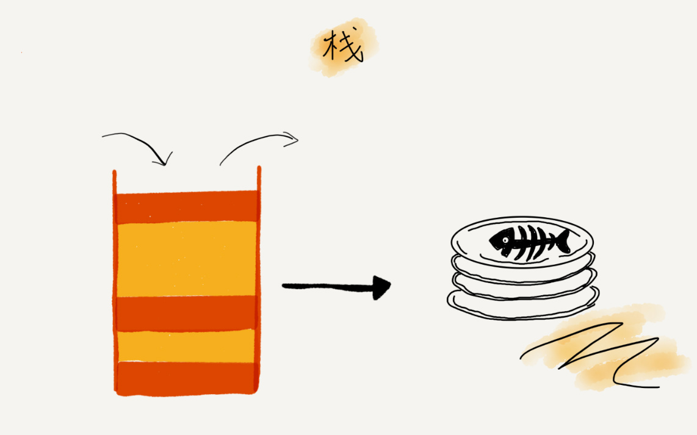

# 栈

- 如何理解栈？

  

  - 后进者先出，先进者后出
  - 一种“操作受限”的线性表：只允许在一端插入和删除数据

- 如何实现一个栈？

  - 数组实现，顺序栈
  - 链表实现，链式栈

- 支持动态扩容的顺序栈

- 栈在函数调用中的应用

  - 函数调用栈
  - 栈帧

- 栈在表达式求值中的应用

  - 编译器通过两个栈实现表达式求值

- 栈在括号匹配中的应用